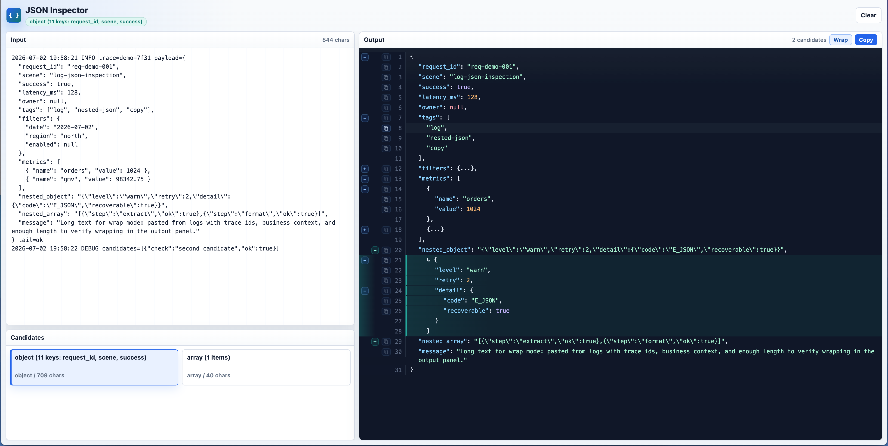
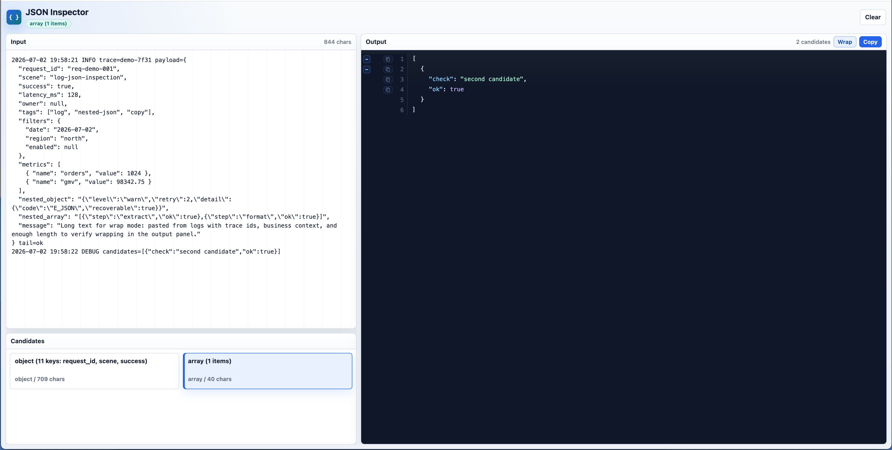

# JSON Inspector

JSON Inspector is a lightweight Chrome extension for extracting, formatting, and inspecting JSON copied from logs or selected from web pages.

It is designed for messy engineering workflows: paste a log line, response payload, copied console text, or selected page text, and the extension will preserve surrounding raw text while formatting every valid JSON segment it can find. Escaped nested JSON strings can be expanded for inspection without changing the original JSON structure.

## Screenshots

Expanded nested JSON preview:



Additional output state:



## Features

- Extract valid JSON objects and arrays from surrounding log text.
- Preserve non-JSON text in the output with visible `TXT` markers.
- Format every detected JSON segment inline in the output.
- Render output with line numbers, folding, wrapping controls, minify/pretty toggle, and node-level copy.
- Preserve the original JSON shape by default.
- Detect string values that contain escaped JSON and provide an inline expand control for separate inspection.
- Copy any rendered node, including nodes inside expanded nested JSON previews.
- Switch between Classic, Light, and Dark themes. Theme choice is remembered locally.
- Open selected text from a web page through the Chrome context menu.
- Runs locally with plain HTML, CSS, and JavaScript. No backend and no build step.

## Nested JSON Behavior

JSON Inspector does not automatically rewrite JSON string values into objects or arrays.

For example, this value remains a string in the main output:

```json
{
  "dataset_id": "{\"a\":\"1\"}"
}
```

When a string value is recognized as JSON, the output gutter shows an expand control. Expanding it renders a marked preview below the original line, while the original output remains unchanged. This keeps copy results predictable and avoids changing the semantic structure of the source JSON.

## Usage

### Screenshot demo input

For screenshots or quick demos, copy the content from:

```text
examples/screenshot-demo-input.txt
```

It includes log text, multiple JSON candidates, nested JSON strings, arrays, primitives, wrapping text, and node-level copy/expand scenarios.

### Open the formatter

Click the extension icon to open the JSON Inspector tab.

Paste logs or JSON into the input pane. JSON Inspector will scan the text and render a source-order output: raw text stays visible, valid JSON objects and arrays are formatted inline.

### Open selected text

Select text on any web page, right-click, and choose:

```text
Open selection in JSON Inspector
```

The selected text is passed into the formatter tab automatically.

### Inspect output

- Use line-number gutter controls to fold, expand nested JSON string previews, or copy a node.
- Use the output header controls to minify/pretty print, switch line wrapping, or copy the full rendered output.
- Use the Theme selector to switch between Classic, Light, and Dark.

## Install Locally

1. Open Chrome and go to `chrome://extensions`.
2. Enable Developer mode.
3. Click Load unpacked.
4. Select this project folder.

## Development

Run the parser tests:

```bash
npm test
```

Main files:

- `manifest.json`: Chrome extension manifest.
- `src/background.js`: extension icon and context-menu behavior.
- `src/formatter.html`: formatter page markup.
- `src/formatter.css`: layout and visual styles.
- `src/formatter.js`: UI state, rendering, copy, fold, and expand interactions.
- `src/jsonTools.js`: JSON extraction, parsing, formatting, and nested JSON detection.
- `tests/jsonTools.test.js`: parser behavior tests.

## Privacy

JSON Inspector processes text locally in the browser. It does not send pasted or selected content to a server.
